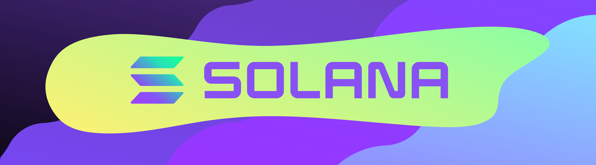
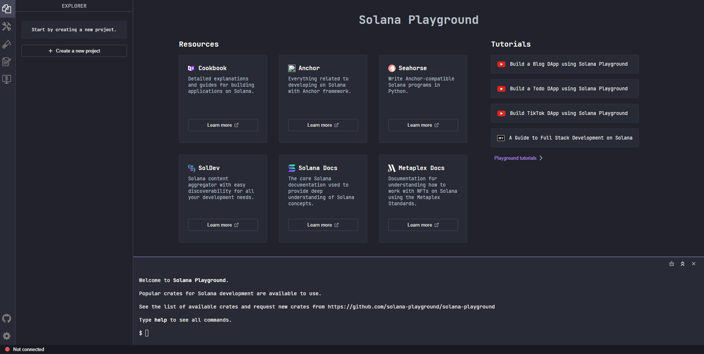
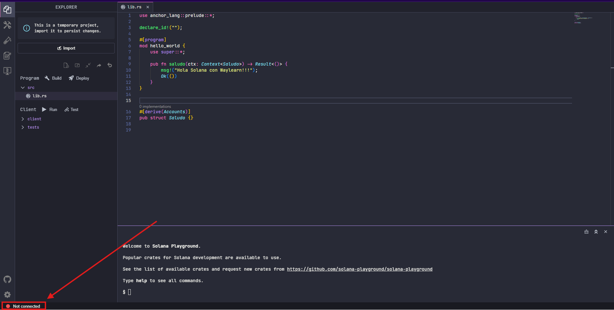

# Primeros pasos en Solana

Solana es una blockchain de capa 1, es decir, cuenta con su propia infraestructura y no depende de otras blockchains para funcionar. Se encuentra orientada al alto rendimiento, y fue creada para soportar aplicaciones descentralizadas a gran escala con costos mínimos y confirmaciones casi inmediatas. Su diseño prioriza la eficiencia en la ejecución y la paralelización de transacciones.

Rust es el lenguaje principal para desarrollar programas en Solana. A través de él se implementa la lógica on-chain utilizando el modelo de cuentas y programas de la red, permitiendo construir contratos inteligentes seguros, eficientes y altamente optimizables.

Puedes comenzar dándole Fork a este repositorio (abajo te explicamos como 👇), **hemos preparado un entorno de codespaces listo para que no tengas que instalar nada!!!**

Asegúrate de clonar este repositorio a tu cuenta usando el botón **`Fork`**.

* Puedes renombrar el repositorio a lo que sea que se ajuste con tu proyecto.

## Solana Playground
Solana Playground es un entorno de desarrollo online que permite escribir, compilar, desplegar y probar programas de Solana directamente desde el navegador, sin necesidad de instalar herramientas locales como Rust, Solana CLI o Anchor.

Para comenzar solo es necesario dar clic 👉 [Aquí](https://beta.solpg.io/https://github.com/WayLearnLatam/Solana-starter-kit/tree/4f4154a3c2ec587a7ed5b26c6d7f2eef7f5c2b9f/Hola-Waylearn)

Lo que abrirá el Playground con un código precargado y simple de entender, el clásico "Hola Mundo".

## Configuración del entorno

Primero conectaremos el entorno con la devnet, lo que tambien procederá a la creación de una wallet. Para eso daremos clic en donde dice **Not Conected**:

Saldrá la siguiente ventana donde daremos en el botón **Continue**:

Como resultado se mostrará la siguiente información:

* En verde: el estado de la conexión y el entorno al que se encuentra conectado

* En amarillo: la la dirección de la wallet conectada

* En azul: la cantidad de tokens en la wallet

> ℹ️ ¿Cuentas con una Wallet de [Phantom](https://phantom.com/) que deseas importar?, Da clic aquí para ver como hacerlo: 👉 ()[]

## Build & Deploy

El **build** prepara el programa para poder usarse. Básicamente, se revisa el código y se transforma en una versión que Solana puede entender. En este paso se detectan errores y se deja todo listo para el deploy. En cambio, el **deploy** es el momento en el que el programa se sube a la red de Solana.

Después del deploy, el programa ya existe en la blockchain y puede ser usado por otras personas o aplicaciones.

https://faucet.solana.com/

