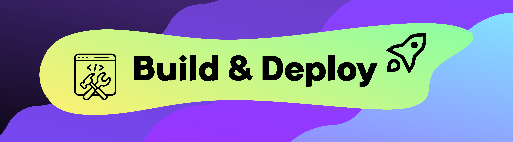
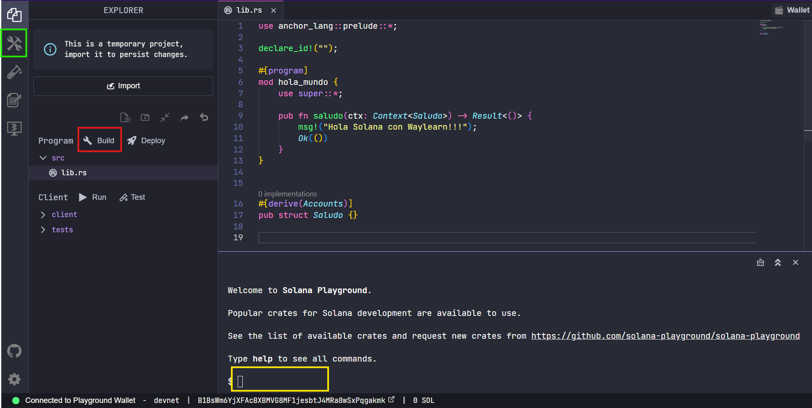
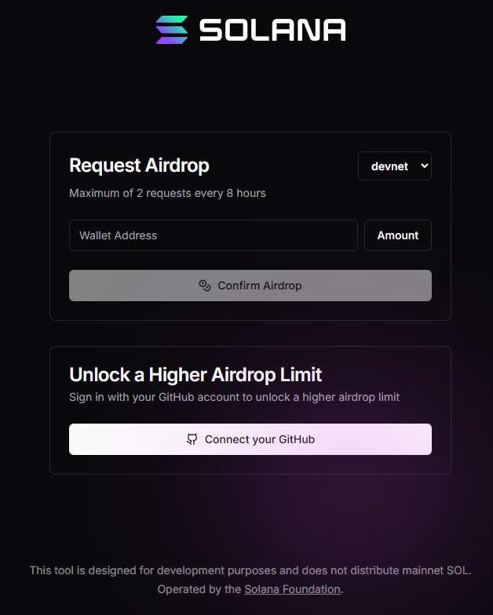
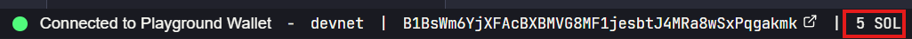
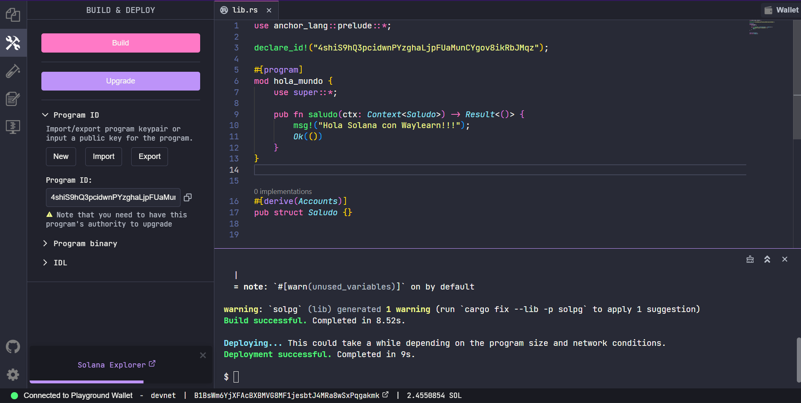
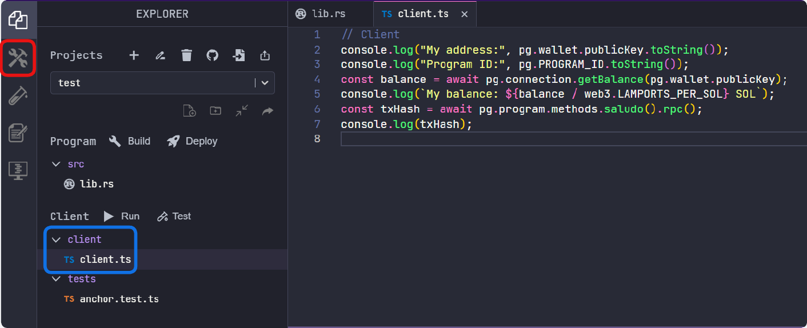
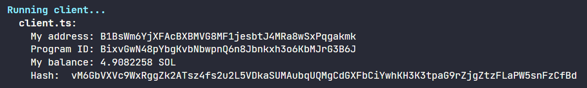
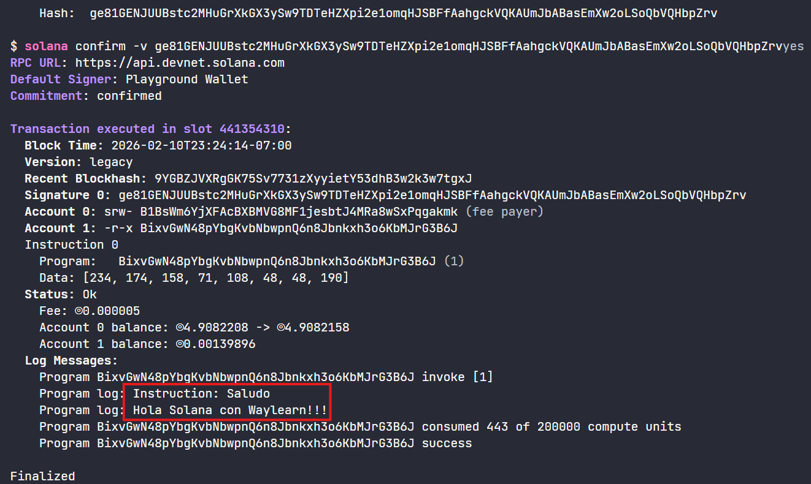

# Build & Deploy



El **build** prepara el programa para poder usarse. Básicamente, se revisa el código y se transforma en una versión que Solana puede entender. En este paso se detectan errores y se deja todo listo para el deploy. En cambio, el **deploy** es el momento en el que el programa se sube a la red de Solana.

Después del **deploy**, el programa ya existe en la blockchain y puede ser usado por otras personas o aplicaciones.

Ya configurado el entorno y teniendo una wallet haremos un ejemplo de **build** y **deploy**. Para comenzar, accederemos al siguiente enlace dando clic 👉 [aquí](https://beta.solpg.io/https://github.com/WayLearnLatam/Solana-starter-kit/tree/d707d118f258cabdb7872a6a9ecd7aa72ea13e7a/hola-mundo). 

Lo que abrirá el Playground con un código precargado y simple de entender, el clásico "Hola Mundo".



Tenemos diferentes opciones para hacer el build del programa:

* Verde: al dar clic en el boton se abrirá el menú **Build & Deploy**, donde aparecerá la opción de hacer el build mediante botones.

* Rojo: dar clic al botón señalado, al lado se encuentra el botón para hacer **deploy**

* Amarillo: escribir `build` y posteriormente `deploy` en la terminal

> ℹ️ **NOTA**: La opción de **deploy** solo estará disponible una vez realizado el **build**.

### Foneando la cuenta
Para proceder con el **deploy** es necesario contar con tokens en nuestra wallet, para ello usaremos el faucet de Solana 👉 [Solana Faucet](https://faucet.solana.com/) 



Para comenzar es necesario conectar la cuenta de Github. Posteriormente, copiaremos y pegaremos la dirección de la wallet en `wallet address` y seleccionamos una cantidad  **(amount)** para finalizar presionando el botón `Confirm Airdrop`. 




Instanteamente contaremos con los tokens en nuestra cuenta, con lo que podemos proceder con el **buld** y el **deploy**:


Ya finalizado se asigna un `Program ID` y se habilita el botón **deploy**:



Al terminal deploy aparece una ventana emergente que nos manda al `Solana Explorer`, donde podemos ver los detalles de la transacción. 

## Interactuando con el código

Para interactuar con el código es necesario estar en el apartado `Build & Deploy` (recuadro de color rojo) y estar en la pestaña `Client` (recuadro azul). Donde encontraremos código en `TypeScript`:



La función que cumple el código es el siguiente:
* `console.log("My address:", program.provider.publicKey.toString());`: Muestra en la dirección de la wallet

* `const balance = await program.provider.connection.getBalance(program.provider.publicKey);`: Consulta a la red de Solana cuántos lamports (la unidad mínima de SOL) tiene esa wallet

* `console.log(`My balance: ${balance / web3.LAMPORTS_PER_SOL} SOL`);`: Convierte el balance de lamports a SOL 

* `const txHash = await program.methods.saludo().rpc();`: Llama a la instrucción saludo del programa en Solana, la ejecuta en la blockchain y devuelve el hash de la transacción

* `console.log(txHash);`: Muestra en pantalla el identificador de la transacción (puede usarse para buscarla en un explorador de Solana)

Para ejecutar el código es necesario presionar el botón `Run`. ubicado en la parte superior del **recuadro azul** de la imagen anterior. Lo que nos proporcionará la siguiente información:



El `hash` es importante ya que en el veremos los mensajes (`msg!`) de nuestro código principal. Para verlo es necesario correr el siguiente comando en la terminal:

```bash
solana confirm -v <HASH>
```

> ℹ️ **Nota**: El hash siempre cambia cada vez que se consulta. 

