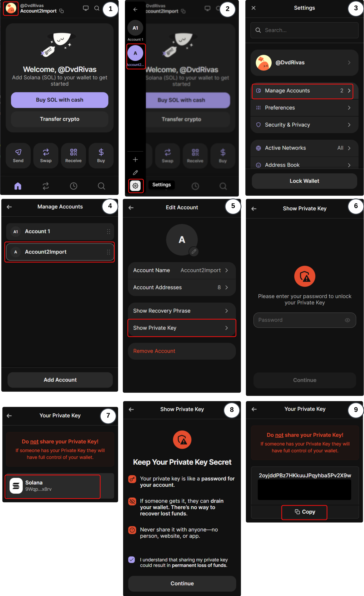
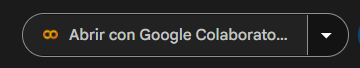
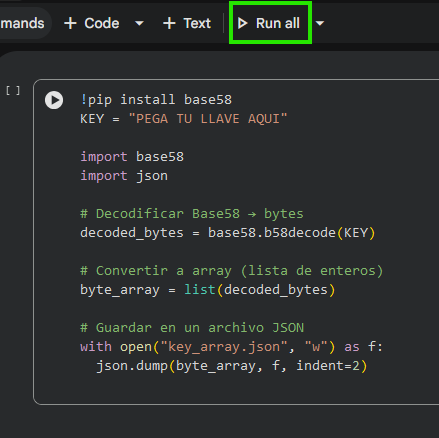
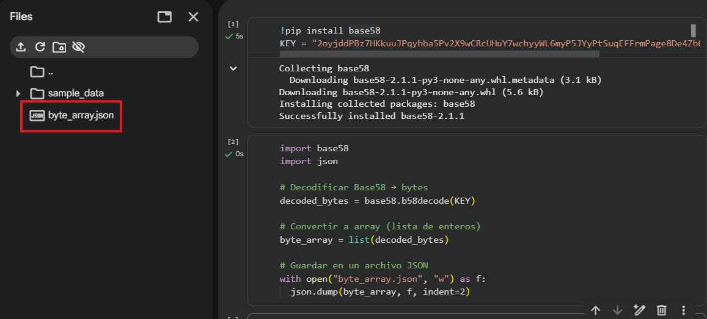
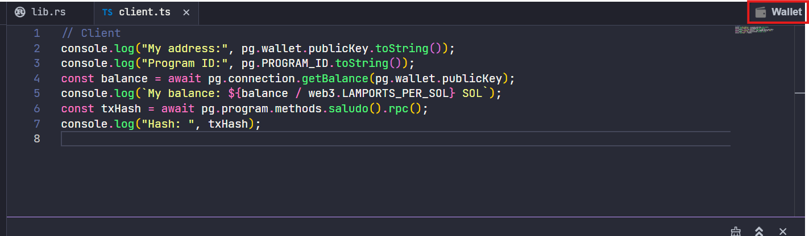
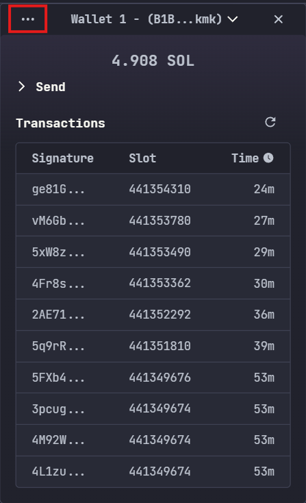
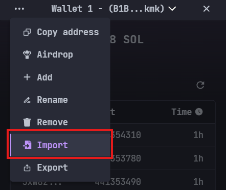

# Conectar Phantom Wallet con Solana Playground 

**Phantom Wallet** es una billetera digital para `Solana` (y otras blockchains) que permite guardar, enviar y recibir tokens, además de conectarse a aplicaciones descentralizadas (`dApps`). Funciona como una extensión de navegador y app móvil, y es la **wallet más usada en el ecosistema Solana**.

Para comenzar es necesario tener la llave privada `Private Key` de la extensión de `Phantom Wallet`, lo que se hace mediante los siguientes pasos:

1. Ya abierta la extension de phantom damos clic en el icono de usuario 

2. Entramos a ajustes dando clic en el icono ubicado en la parte inferior izquierda

3. Damos clic la opción `Manage Accounts`

4. Seleccionamos la cuenta que deseamos exportar

5. Clic en `Show Private Key`

6. Introducimos la contraseña

7. Damos clic en la red de Solana

8. Confirmamos que dando clic en el recuadro morado y precionamos continuar

9. Y finalmente copiamos la llave privada.

Para poder hacer la importación en el `Solana Playground` es necesario convertir la llave privada en un array de numeros base58. Para ello haremos uso del siguiente código de `Python`: 👉 [Convertir llave a base58](https://drive.google.com/file/d/1Ih-Hmsy0B1cLm5mYhPQxa7DIFT8SSXgZ/view?usp=sharing)

Para abrir el codigo es necesario presionar el siguiente botón:

Lo que nos abrirá un cuaderno de `Python` en `Google Colaboratory`:

Donde solo es necesario pegar la llave de Phantom en donde dice `PEGA TU LLAVE AQUI` y ejecutar las celdas presionando dos veces `SHIFT + ENTER`:

Al finalizar la ejecución nos generará un archivo de nombre `key_array.json`, que descargaremos presionando clic derecho y `Download`.

Para continuar es necesario volver al `Playground de solana`, donde es necesario acceder al menú de la wallet que se encuentra en la parte superior derecha:

Damos clic en los tres puntos:

Y seleccionamos la opcion `Import`:

Lo que nos abrirá el selector de archivos. Por último, es necesario elegir el `key_array.json` que descargamos anteriormente.

Y listo, con eso ya tendriamos el address de `Phantom` lista para usar en el `Solana Playground` 🥳 !!!  